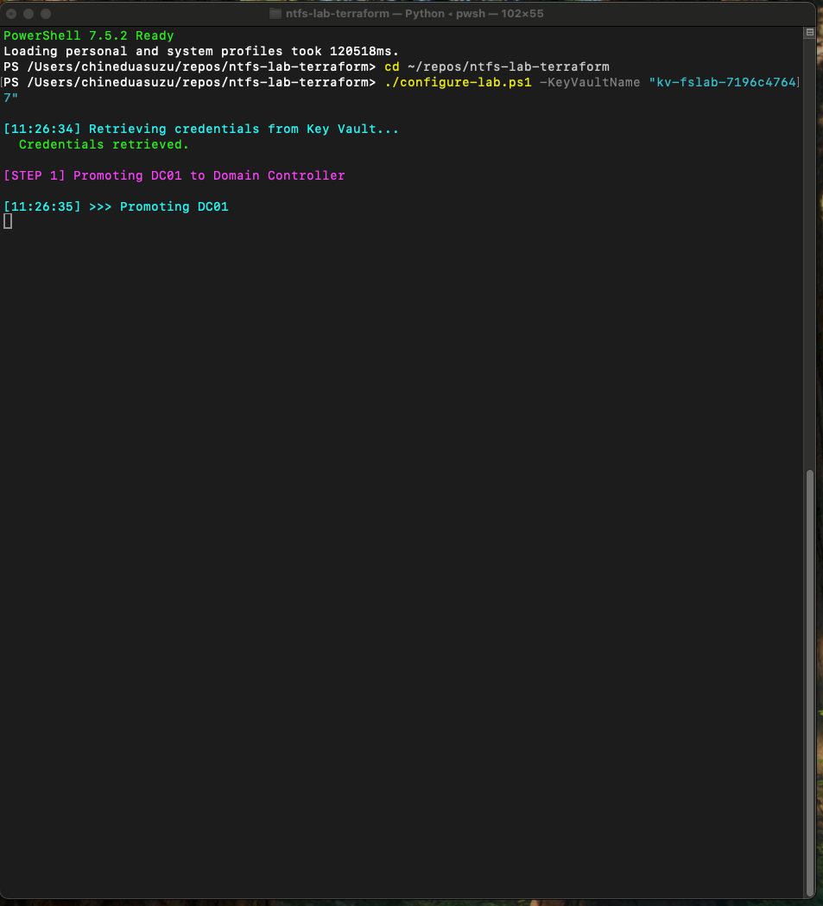
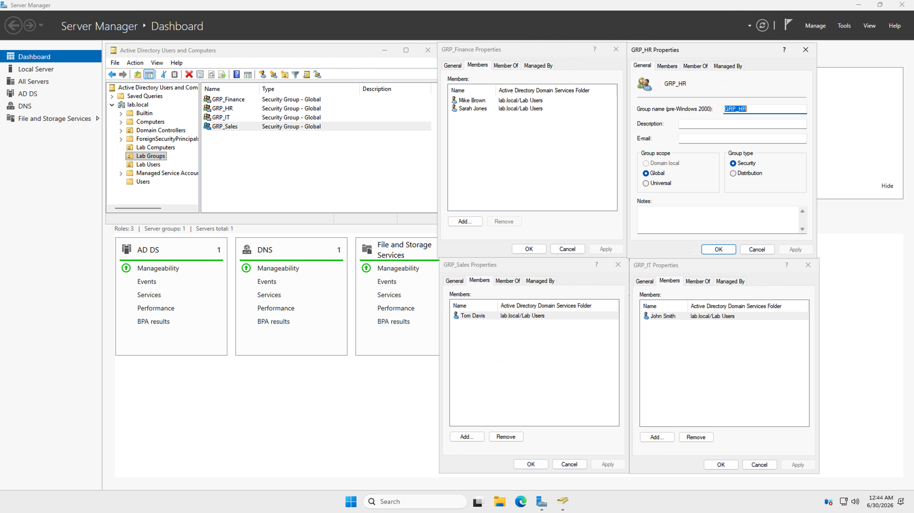
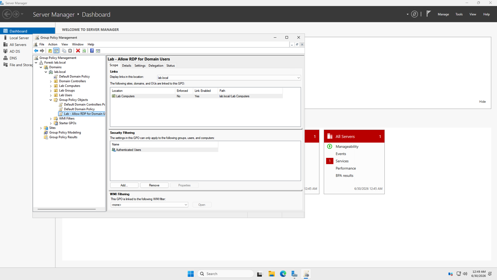

# Lab 2: Active Directory Domain Services


## Overview

This is the second lab in a three-part series. Building on the Azure infrastructure deployed in Lab 1, I configure a fully functional **Active Directory Domain Services** environment on Windows Server 2025.

All configuration is done through a phased PowerShell automation approach using Azure VM Run Commands — following best practice by keeping OS-level configuration completely separate from Terraform infrastructure provisioning.

---

## Lab Series

| Lab | Title | Skills |
|-----|-------|--------|
| [Lab 1](https://github.com/kingsrule50/ntfs-lab-terraform) | Azure Infrastructure with Terraform | Terraform, Azure Networking, IaC |
| **Lab 2** (this repo) | Active Directory Domain Services | Windows Server, AD DS, GPO, PowerShell |
| [Lab 3](https://github.com/kingsrule50/ntfs-lab-fileserver) | NTFS File Server and Access Control | SMB, NTFS, RBAC, Access Control |

---

## Architecture


*This lab covers Phases 2–3 (AD DS install and DC promotion) and Phases labeled AD Objects and GPO in the series architecture.*

---

## What Gets Configured

### Domain
- Domain: `lab.local`
- NetBIOS: `LAB`
- Domain Controller: `DC01` (`10.0.1.5`)

### Organizational Units
| OU | Purpose |
|----|---------|
| Lab Users | All domain user accounts |
| Lab Groups | All security groups |
| Lab Computers | Domain-joined workstations |

### Security Groups
| Group | Scope | Purpose |
|-------|-------|---------|
| GRP_Finance | Global Security | Finance department access |
| GRP_HR | Global Security | HR department access |
| GRP_Sales | Global Security | Sales department access |
| GRP_IT | Global Security | IT full control access |

### User Accounts
| Username | Full Name | Group |
|----------|-----------|-------|
| john.smith | John Smith | GRP_IT |
| sarah.jones | Sarah Jones | GRP_Finance |
| mike.brown | Mike Brown | GRP_Finance |
| lisa.white | Lisa White | GRP_HR |
| tom.davis | Tom Davis | GRP_Sales |

### Group Policy
| GPO | Linked To | Setting |
|-----|-----------|---------|
| Lab - Allow RDP for Domain Users | Lab Computers OU | fDenyTSConnections = 0 |

---

## Phased Deployment Approach

This lab follows the recommended phased deployment pattern to avoid the timing and state issues that occur when mixing infrastructure provisioning with OS-level configuration.

```
Phase 1 - Verify Lab 1 infrastructure is running
Phase 2 - Install AD DS feature on DC01
          [DC01 reboots]
Phase 3 - Promote DC01 to Domain Controller
          [DC01 reboots, AD initializes]
Phase 4 - Create OUs, Security Groups and User Accounts
Phase 5 - Configure Group Policy
Phase 6 - Verify Active Directory configuration
```

---

## Prerequisites

- **Lab 1 must be deployed first** — [ntfs-lab-terraform](https://github.com/kingsrule50/ntfs-lab-terraform)
- Azure CLI installed and authenticated (`az login`)
- PowerShell 7+ installed on your machine

---

## Usage

**Step 1 — Navigate to the repo:**
```powershell
cd /path/to/ntfs-lab-ad
```

**Step 2 — Run the lab:**
```powershell
./run-lab2.ps1
```


*The orchestration script retrieves the admin credentials from Azure Key Vault at runtime before promoting DC01 — no passwords are stored in code or passed on the command line.*

The script pauses between each phase and waits for you to press **Enter** before proceeding. This allows you to verify each phase completed successfully before moving to the next.

**Step 3 — Proceed to Lab 3:**
Once verification passes, proceed to [Lab 3 - NTFS File Server](https://github.com/kingsrule50/ntfs-lab-fileserver).

---

## Credentials

| Account | Username | Source |
|---------|----------|--------|
| Local Admin | azureadmin | Retrieved from Azure Key Vault (`vm-admin-password`) |
| DSRM | (recovery) | Generated at promotion time |
| Domain Users | see table above | Set during provisioning; rotate after first logon |

No passwords are committed to this repository — the orchestration script pulls credentials from Key Vault at runtime.

---

## File Structure

```
ntfs-lab-ad/
├── run-lab2.ps1                    # Master orchestration script
└── scripts/
    ├── phase1-verify-infra.ps1     # Verify Lab 1 VMs are running
    ├── phase2-install-adds.ps1     # Install AD DS Windows feature
    ├── phase3-promote-dc.ps1       # Promote DC01 to Domain Controller
    ├── phase4-configure-ad.ps1     # Create OUs, Groups, Users
    ├── phase5-configure-gpo.ps1    # Configure Group Policy
    └── phase6-verify-ad.ps1        # Verify all AD objects
```

---

## Expected Verification Output

```
=== Phase 6: Active Directory Verification ===
  [PASS] OU: Lab Users
  [PASS] OU: Lab Groups
  [PASS] OU: Lab Computers
  [PASS] Group: GRP_Finance
  [PASS] Group: GRP_HR
  [PASS] Group: GRP_Sales
  [PASS] Group: GRP_IT
  [PASS] john.smith --> GRP_IT
  [PASS] sarah.jones --> GRP_Finance
  [PASS] mike.brown --> GRP_Finance
  [PASS] lisa.white --> GRP_HR
  [PASS] tom.davis --> GRP_Sales
=== Lab 2 Verification PASSED ===
```

---

## Configuration Results

**OUs, security groups, and users created in `lab.local`:**


*Active Directory Users and Computers on DC01 — the four department groups under the Lab Groups OU, with group membership matching the RBAC design (e.g., Mike Brown and Sarah Jones in GRP_Finance, John Smith in GRP_IT).*

**Group Policy configured and linked:**


*The `Lab - Allow RDP for Domain Users` GPO linked to the Lab Computers OU in Group Policy Management.*

---

## Skills Demonstrated

- Windows Server 2025 administration
- Active Directory Domain Services installation and promotion
- Organizational Unit design and creation
- Security group strategy (department-based RBAC)
- User account provisioning via PowerShell
- Group Policy Object creation and linking
- PowerShell automation with Azure VM Run Commands
- Phased deployment methodology

---

## Author

**Chinedu Asuzu** | Cloud Security Engineer  
[GitHub](https://github.com/kingsrule50) | [LinkedIn](https://linkedin.com/in/chineduasuzu)  
Certifications: CISA | CompTIA Security+ | Microsoft SC-401
